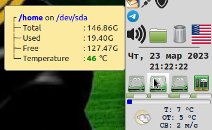

# Linux-things

Всякие мелочи для linux.

All sorts of little things for linux.

## [remove-r.sh](remove-r.sh)

Удаляет возврат каретки из файлов. Если аргумент - каталог, то имена файлов в нём проверяются на соответствие масок для исходников и всего похожего на них (с моей точки зрения, конечно).

Removes carriage returns from files. If the argument is a directory, then the filenames in it are checked against the masks for source codes and everything similar to them (from my point of view, of course).

## [fcopies.pl](fcopies.pl)

Search for copies of the specified file (-f) in paths (-p).
Print errors if the -q switch is not specified.
Symbolic link processing is disabled by default, use the -s switch to enable it.
Default file digest is 'MD5', set it by -d key (see https://metacpan.org/pod/Digest).
Match only base name of file if -n key is specified.


## [dir-mon.pl](dir-mon.pl)

Мониторит каталоги и отслеживает время неактивности. При его достижении запускает то, что сказано. Самый простой пример запуска:

Monitors directories and keeps track of inactivity time. When it is reached, it launches what is said. The simplest run example:

```bash
$ ./dir-mon.pl -p "$HOME/luks-disk" -e "$HOME/bin/umount-luks-disk.sh" -t 600
# При отсутствии активности в течении 10 минут размонтировать LUKS-диск и удалить
# его из /dev/mapper. Средствами mount, automount, systemd-mount etc такое полноценно 
# не получится, ради чего, собственно, эта утилита и писалась (но может использоваться 
# для чего угодно).
# If there is no activity for 10 minutes, unmount the LUKS disk and delete
# it from /dev/mapper. By means of mount, automount, systemd-mount etc, this is fully
# will not work, for which, in fact, this utility was written (but can be used
# for whatever).
```

See `-?`, `-h`, `-help`.

## [dir-mon.sh](dir-mon.sh)

То же самое, но чуть пожиже и на чистом `bash`.

The same, but in pure `bash`.

## [tray-run](https://github.com/klopp/tray-run/)

Запускалка программ из трея. Подробности в тамошнем README.

## [xfce4-genmon](xfce4-genmon/)

Скрипты для [xfce4-genmon-plugin](https://docs.xfce.org/panel-plugins/xfce4-genmon-plugin/start).

 

### [genmon-mem.sh](xfce4-genmon/genmon-mem.sh)

Мониторит память. В тултипе показывает информацию. Если памяти занято больше порога, иконка и прочее зелёное краснеют. При клике по иконке запускает [xfce4-taskmanager](https://docs.xfce.org/apps/xfce4-taskmanager/start) или что прикажут.

 

### [genmon-cpu.sh](xfce4-genmon/genmon-cpu.sh)

Мониторит процессоры. В тултипе показывает всякое. Если температура кого-то из них больше порога, иконка и прочее зелёное краснеют. При клике по иконке запускает [xfce4-taskmanager](https://docs.xfce.org/apps/xfce4-taskmanager/start) или что прикажут.

 

### [genmon-disks.sh](xfce4-genmon/genmon-disks.sh)

Мониторит разделы. В тултипе показывает всего/занято/свободно и температуру носителя. Если температура больше порога, иконка и прочее зелёное краснеют. При клике по иконке запускает `sudo` [gnome-disks](https://wiki.gnome.org/Apps/Disks) или что прикажут:

 

### [genmon-imap.pl](xfce4-genmon/genmon-imap.pl)

Мониторит ящики в IMAP. Подробности по ключу `-h` или `--help`.

Все аккаунты в одном конфиге:

 

Отдельные конфиги:

 
