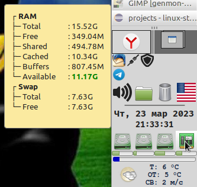

# Linux-things

Всякие мелочи для linux.

## remove-r.sh

Удаляет возврат каретки из файлов. Если аргумент - каталог, то имена файлов в нём проверяются на соответствие масок для исходников и всего похожего на них (с моей точки зрения, конечно).

## xfce4-genmon

Скрипты для [xfce4-genmon-plugin](https://docs.xfce.org/panel-plugins/xfce4-genmon-plugin/start).

 

### genmon-mem.sh

Мониторит память. В тултипе показывает информацию. Если памяти занято больше порога, иконка и прочее зелёное краснеют. При клике по иконке запускает [xfce4-taskmanager](https://docs.xfce.org/apps/xfce4-taskmanager/start).

 

### genmon-disks.sh

Мониторит разделы. В тултипе показывает всего/занято/свободно и температуру носителя. Если температура больше порога, иконка и прочее зелёное краснеют. При клике по иконке запускает что найдёт первым, в порядке:

* [gnome-disks](https://wiki.gnome.org/Apps/Disks)
* [gparted](https://gparted.org/)
* [bleachbit](https://www.bleachbit.org/)

 